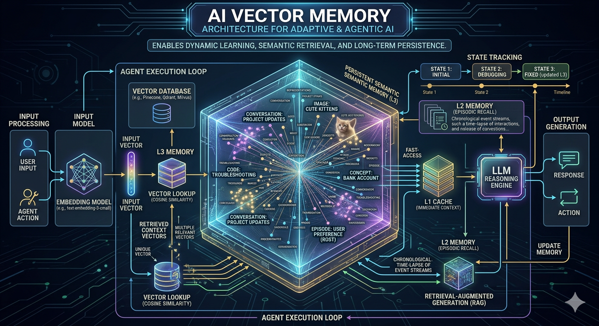
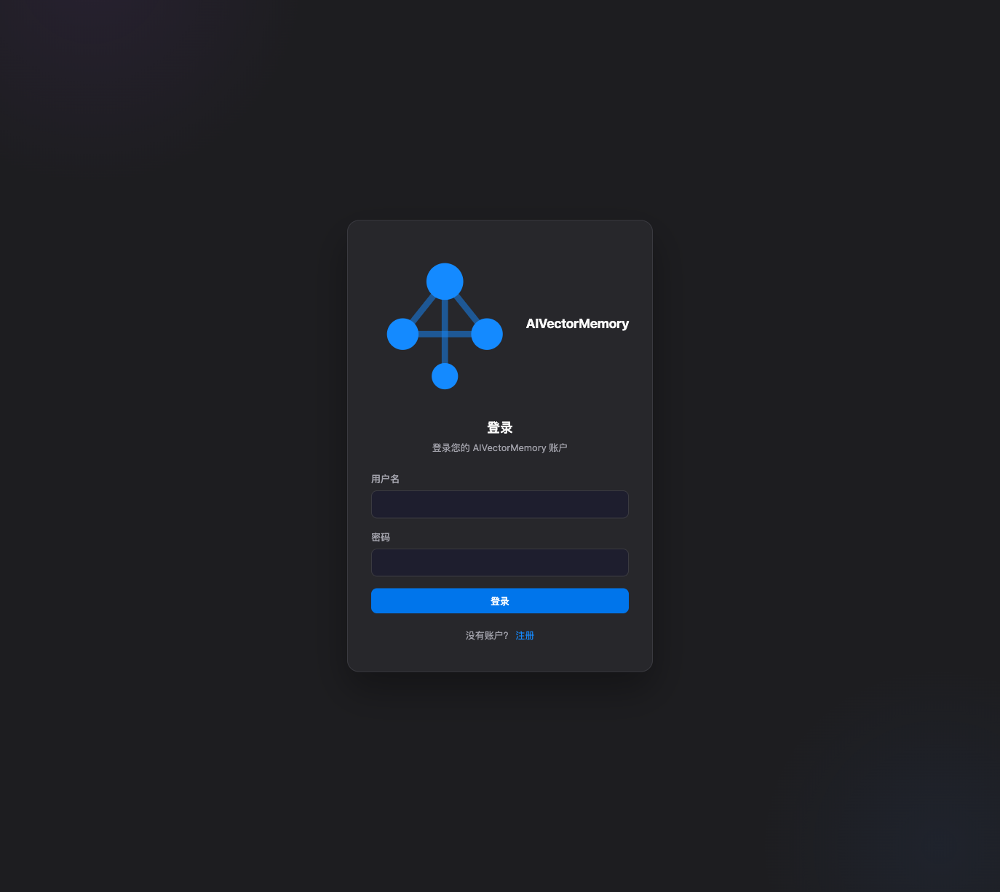
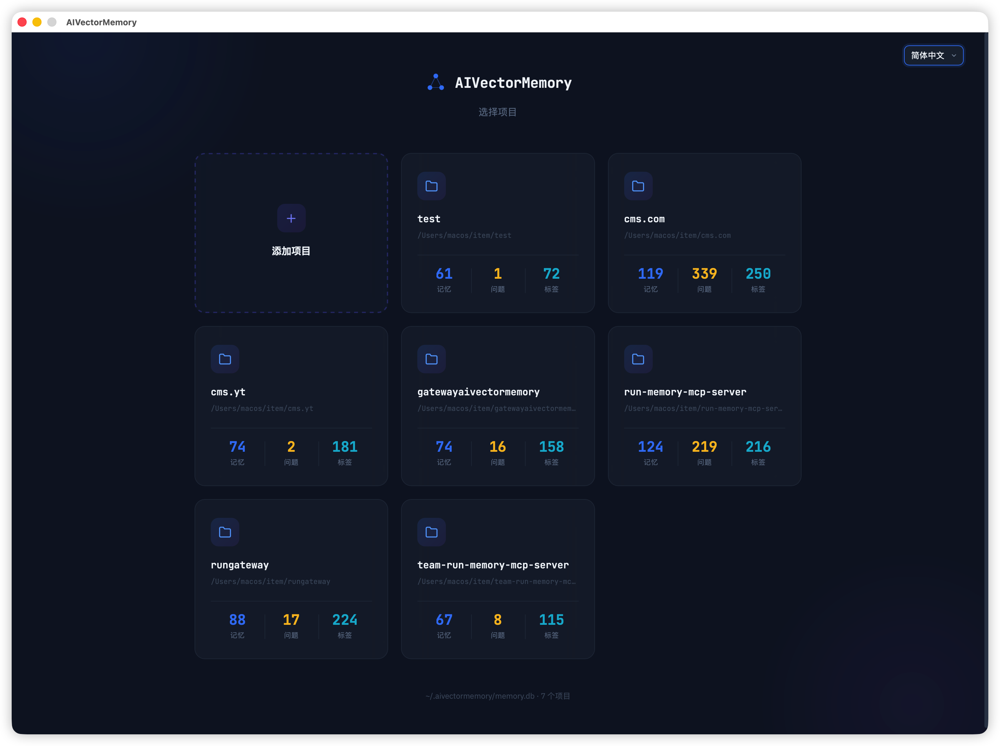
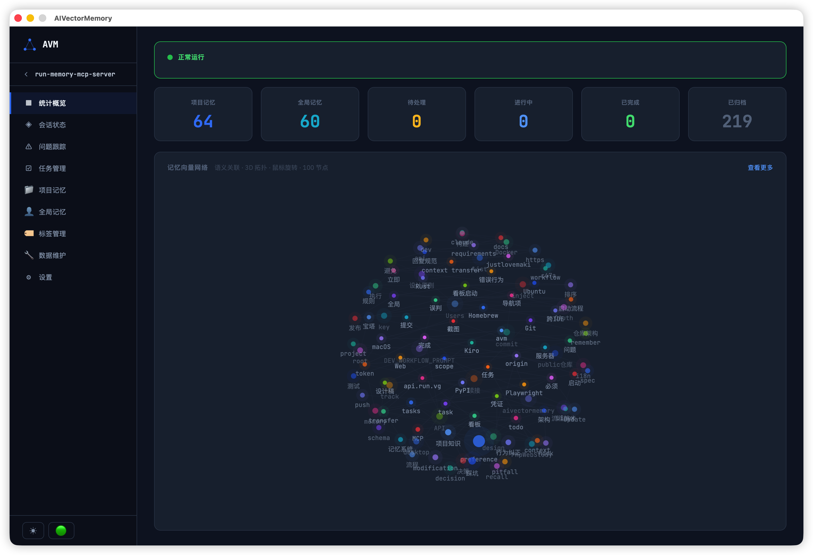
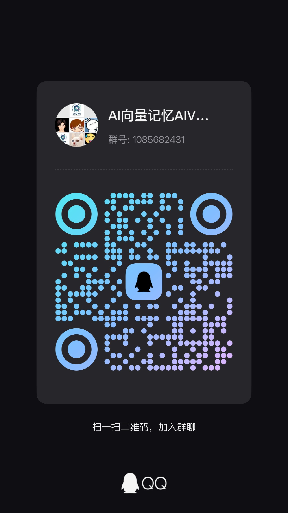

🌐 [简体中文](docs/README.zh-CN.md) | [繁體中文](docs/README.zh-TW.md) | English | [Español](docs/README.es.md) | [Deutsch](docs/README.de.md) | [Français](docs/README.fr.md) | [日本語](docs/README.ja.md)

<p align="center">
  
</p>

<p align="center">
  
</p>
<h1 align="center">AIVectorMemory</h1>
<p align="center">
  <strong>Give your AI coding assistant a memory — Cross-session persistent memory MCP Server</strong>
</p>
<p align="center">
  <a href="https://pypi.org/project/aivectormemory/"></a>
  <a href="https://pypi.org/project/aivectormemory/"></a>
  <a href="https://github.com/Edlineas/aivectormemory/blob/main/LICENSE"></a>
  <a href="https://modelcontextprotocol.io"></a>
</p>

---

> **Still using CLAUDE.md / MEMORY.md as memory?** This Markdown-file memory approach has fatal flaws: the file keeps growing, injecting everything into every session and burning massive tokens; content only supports keyword matching — search "database timeout" and you won't find "MySQL connection pool pitfall"; sharing one file across projects causes cross-contamination; there's no task tracking, so dev progress lives entirely in your head; not to mention the 200-line truncation, manual maintenance, and inability to deduplicate or merge.
>
> **AIVectorMemory is a fundamentally different approach.** Local vector database storage with semantic search for precise recall (matches even when wording differs), on-demand retrieval that loads only relevant memories (token usage drops 50%+), automatic multi-project isolation with zero interference, and built-in issue tracking + task management that lets AI fully automate your dev workflow. All data is permanently stored on your machine — zero cloud dependency, never lost when switching sessions or IDEs.

## ✨ Core Features

| Feature | Description |
|---------|-------------|
| 🧠 **Cross-Session Memory** | Your AI finally remembers your project — pitfalls, decisions, conventions all persist across sessions |
| 🔍 **Semantic Search** | No need to recall exact wording — search "database timeout" and find "MySQL connection pool issue" |
| 💰 **Save 50%+ Tokens** | Stop copy-pasting project context every conversation. Semantic retrieval on demand, no more bulk injection |
| 🔗 **Task-Driven Dev** | Issue tracking → task breakdown → status sync → linked archival. AI manages the full dev workflow |
| 📊 **Desktop App + Web Dashboard** | Native desktop app (macOS/Windows/Linux) + Web dashboard, visual management for memories and tasks, 3D vector network reveals knowledge connections at a glance |
| 🏠 **Fully Local** | Zero cloud dependency. ONNX local inference, no API Key, data never leaves your machine |
| 🔌 **All IDEs** | Cursor / Kiro / Claude Code / Codex CLI / Claude Desktop / Windsurf / VSCode / OpenCode / Trae — one-click install, works out of the box |
| 📁 **Multi-Project Isolation** | One DB for all projects, auto-isolated with zero interference, seamless project switching |
| 🔄 **Smart Dedup** | Similarity > 0.95 auto-merges updates, keeping your memory store clean — never gets messy over time |
| 🌐 **7 Languages** | 简体中文 / 繁體中文 / English / Español / Deutsch / Français / 日本語, full-stack i18n for dashboard + Steering rules |

<p align="center">
  QQ群：1085682431 &nbsp;|&nbsp; 微信：changhuibiz<br>
  共同参与项目开发加QQ群或微信交流
</p>

<p align="center">
  
  <br>
  <em>Login</em>
</p>

<p align="center">
  
  <br>
  <em>Project Selection</em>
</p>

<p align="center">
  
  <br>
  <em>Overview & Vector Network</em>
</p>

## 🏗️ Architecture

```
┌─────────────────────────────────────────────────┐
│                   AI IDE                         │
│  OpenCode / Claude Code / Cursor / Kiro / ...   │
└──────────────────────┬──────────────────────────┘
                       │ MCP Protocol (stdio)
┌──────────────────────▼──────────────────────────┐
│              AIVectorMemory Server               │
│                                                  │
│  ┌──────────┐ ┌──────────┐ ┌──────────────────┐ │
│  │ remember │ │  recall   │ │   auto_save      │ │
│  │ forget   │ │  task     │ │   status/track   │ │
│  └────┬─────┘ └────┬─────┘ └───────┬──────────┘ │
│       │            │               │             │
│  ┌────▼────────────▼───────────────▼──────────┐  │
│  │         Embedding Engine (ONNX)            │  │
│  │      intfloat/multilingual-e5-small        │  │
│  └────────────────────┬───────────────────────┘  │
│                       │                          │
│  ┌────────────────────▼───────────────────────┐  │
│  │     SQLite + sqlite-vec (Vector Index)     │  │
│  │     ~/.aivectormemory/memory.db            │  │
│  └────────────────────────────────────────────┘  │
└──────────────────────────────────────────────────┘
```

## 🚀 Quick Start

### Option 1: pip install (Recommended)

```bash
# Install
pip install aivectormemory

# Upgrade to latest version
pip install --upgrade aivectormemory

# Navigate to your project directory, one-click IDE setup
cd /path/to/your/project
run install
```

`run install` interactively guides you to select your IDE, auto-generating MCP config, Steering rules, and Hooks — no manual setup needed.

> **macOS users note**:
> - If you get `externally-managed-environment` error, add `--break-system-packages`
> - If you get `enable_load_extension` error, your Python doesn't support SQLite extension loading (macOS built-in Python and python.org installers don't support it). Use Homebrew Python instead:
>   ```bash
>   brew install python
>   /opt/homebrew/bin/python3 -m pip install aivectormemory
>   ```

### Option 2: uvx (zero install)

No `pip install` needed, run directly:

```bash
cd /path/to/your/project
uvx --from aivectormemory@latest run install
```

> Requires [uv](https://docs.astral.sh/uv/getting-started/installation/) to be installed. `uvx` auto-downloads and runs the package — no manual installation needed.
> 对 MCP stdio 场景，建议使用 `uvx -q --no-progress --from ...`，避免安装输出污染协议流。

### Option 3: Codex CLI quick setup

```bash
cd /path/to/your/project
run install          # choose Codex CLI in the interactive installer

# Or register once globally (works in all projects, dynamic current dir)
codex mcp add aivectormemory -- uvx -q --no-progress --from aivectormemory@latest run --project-dir .
```

### Option 4: Manual configuration

```json
{
  "mcpServers": {
    "aivectormemory": {
      "command": "run",
      "args": ["--project-dir", "/path/to/your/project"]
    }
  }
}
```

<details>
<summary>📍 IDE Configuration File Locations</summary>

| IDE | Config Path |
|-----|------------|
| Kiro | `.kiro/settings/mcp.json` |
| Cursor | `.cursor/mcp.json` |
| Claude Code | `.mcp.json` |
| Windsurf | `.windsurf/mcp.json` |
| VSCode | `.vscode/mcp.json` |
| Trae | `.trae/mcp.json` |
| OpenCode | `opencode.json` |
| Codex CLI | Register with `codex mcp add` (stored in user-level Codex MCP config) |
| Claude Desktop | `~/Library/Application Support/Claude/claude_desktop_config.json` |

</details>

## 📘 Tutorial

- [Codex CLI tutorial (single setup, dynamic project dir)](docs/codex-cli-tutorial.md)

## 🛠️ 8 MCP Tools

### `remember` — Store a memory

```
content (string, required)   Memory content in Markdown format
tags    (string[], required)  Tags, e.g. ["pitfall", "python"]
scope   (string)              "project" (default) / "user" (cross-project)
```

Similarity > 0.95 auto-updates existing memory, no duplicates.

### `recall` — Semantic search

```
query   (string)     Semantic search keywords
tags    (string[])   Exact tag filter
scope   (string)     "project" / "user" / "all"
top_k   (integer)    Number of results, default 5
```

Vector similarity matching — finds related memories even with different wording.

### `forget` — Delete memories

```
memory_id  (string)     Single ID
memory_ids (string[])   Batch IDs
```

### `status` — Session state

```
state (object, optional)   Omit to read, pass to update
  is_blocked, block_reason, current_task,
  next_step, progress[], recent_changes[], pending[]
```

Maintains work progress across sessions, auto-restores context in new sessions.

### `track` — Issue tracking

```
action   (string)   "create" / "update" / "archive" / "list"
title    (string)   Issue title
issue_id (integer)  Issue ID
status   (string)   "pending" / "in_progress" / "completed"
content  (string)   Investigation content
```

### `task` — Task management

```
action     (string, required)  "batch_create" / "update" / "list" / "delete" / "archive"
feature_id (string)            Linked feature identifier (required for list)
tasks      (array)             Task list (batch_create, supports subtasks)
task_id    (integer)           Task ID (update)
status     (string)            "pending" / "in_progress" / "completed" / "skipped"
```

Links to spec docs via feature_id. Update auto-syncs tasks.md checkboxes and linked issue status.

### `readme` — README generation

```
action   (string)    "generate" (default) / "diff" (compare differences)
lang     (string)    Language: en / zh-TW / ja / de / fr / es
sections (string[])  Specify sections: header / tools / deps
```

Auto-generates README content from TOOL_DEFINITIONS / pyproject.toml, multi-language support.

### `auto_save` — Auto save preferences

```
preferences  (string[])  User-expressed technical preferences (fixed scope=user, cross-project)
extra_tags   (string[])  Additional tags
```

Auto-extracts and stores user preferences at end of each conversation, smart dedup.

### `auto_save` 调用时机与触发链

`auto_save` 不是服务端定时任务，也不会在 `run` 启动后自动执行；只有客户端主动发起 MCP
`tools/call(name="auto_save")` 时才会调用。

触发链如下：

1. 启动 `run --project-dir <dir>` 进入 MCP Server 模式。
2. 客户端先完成 `initialize` / `tools/list`。
3. 客户端在需要保存时发送 `tools/call`，其中 `name="auto_save"`。
4. 服务端根据 `TOOL_HANDLERS` 路由到 `handle_auto_save`，执行入库与去重。

对应实现位置：

- `aivectormemory/__main__.py`：`run` 分支启动 `run_server(...)`
- `aivectormemory/server.py`：`tools/call` 分发到具体工具 handler
- `aivectormemory/tools/__init__.py`：`"auto_save": handle_auto_save`
- `aivectormemory/tools/auto_save.py`：`handle_auto_save` 具体逻辑

## 📊 Web Dashboard

```bash
run web --port 9080
run web --port 9080 --quiet          # Suppress request logs
run web --port 9080 --quiet --daemon  # Run in background (macOS/Linux)
run web --port 9080 --token your-server-token  # Optional hard gate for all API requests
```

Visit `http://localhost:9080` in your browser. If no account exists, register first, then log in.

## 🧪 Doctor & Migration Commands

```bash
# Codex MCP doctor (config + stdio probe)
run doctor codex

# Config-only doctor
run doctor codex --no-probe

# Project rename migration (dry-run first)
run migrate-project --from E:/VSCodeSpace/ace-lite --to E:/VSCodeSpace/ace --dry-run

# Apply migration (auto backup by default)
run migrate-project --from E:/VSCodeSpace/ace-lite --to E:/VSCodeSpace/ace
```

Notes:

- `run doctor codex` verifies `codex mcp get`, recommended args
  (`uvx -q --no-progress --from ... --project-dir .`), and probes
  `initialize -> tools/list -> status -> auto_save`.
- `run migrate-project` migrates all tables with `project_dir`; when
  `session_state` conflicts, it auto-merges source and target rows.

Security model (v1.0.11+ hardening):

- All business APIs require `Authorization: Bearer <session_token>`
- If `--token` is enabled, all API requests must also include `X-AVM-Server-Token: <server-token>`
- `/api/auth/register` and `/api/auth/login` are the only public auth endpoints
- Session tokens and login rate-limit lock state are persisted in SQLite (still enforced after process restart)
- Changing password revokes all existing session tokens for that account

- Multi-project switching, memory browse/search/edit/delete/export/import
- Semantic search (vector similarity matching)
- One-click project data deletion
- Session status, issue tracking
- Tag management (rename, merge, batch delete)
- Token authentication protection
- 3D vector memory network visualization
- 🌐 Multi-language support (简体中文 / 繁體中文 / English / Español / Deutsch / Français / 日本語)

<p align="center">
  
  &nbsp;&nbsp;&nbsp;&nbsp;
  
  <br>
  <em>Scan to join WeChat group &nbsp;|&nbsp; Scan to join QQ group</em>
</p>

## ⚡ Pairing with Steering Rules

AIVectorMemory is the storage layer. Use Steering rules to tell AI **when and how** to call these tools.

Running `run install` auto-generates Steering rules and Hooks config — no manual setup needed.

| IDE | Steering Location | Hooks |
|-----|------------------|-------|
| Kiro | `.kiro/steering/aivectormemory.md` | `.kiro/hooks/*.hook` |
| Cursor | `.cursor/rules/aivectormemory.md` | `.cursor/hooks.json` |
| Claude Code | `CLAUDE.md` (appended) | `.claude/settings.json` |
| Windsurf | `.windsurf/rules/aivectormemory.md` | `.windsurf/hooks.json` |
| VSCode | `.github/copilot-instructions.md` (appended) | `.claude/settings.json` |
| Trae | `.trae/rules/aivectormemory.md` | — |
| OpenCode | `AGENTS.md` (appended) | `.opencode/plugins/*.js` |

<details>
<summary>📋 Steering Rules Example (auto-generated)</summary>

```markdown
# AIVectorMemory - Workflow Rules

## 1. New Session Startup (execute in order)

1. `recall` (tags: ["project-knowledge"], scope: "project", top_k: 100) load project knowledge
2. `recall` (tags: ["preference"], scope: "user", top_k: 20) load user preferences
3. `status` (no state param) read session state
4. Blocked → report and wait; Not blocked → enter processing flow

## 2. Message Processing Flow

- Step A: `status` read state, wait if blocked
- Step B: Classify message type (chat/correction/preference/code issue)
- Step C: `track create` record issue
- Step D: Investigate (`recall` pitfalls + read code + find root cause)
- Step E: Present plan to user, set blocked awaiting confirmation
- Step F: Modify code (`recall` pitfalls before changes)
- Step G: Run tests to verify
- Step H: Set blocked awaiting user verification
- Step I: User confirms → `track archive` + clear block

## 3. Blocking Rules

Must `status({ is_blocked: true })` when proposing plans or awaiting verification.
Only clear after explicit user confirmation. Never self-clear.

## 4-9. Issue Tracking / Code Checks / Spec Task Mgmt / Memory Quality / Tool Reference / Dev Standards

(Full rules auto-generated by `run install`)
```

</details>

<details>
<summary>🔗 Hooks Config Example (Kiro only, auto-generated)</summary>

Auto-save on session end removed. Dev workflow check (`.kiro/hooks/dev-workflow-check.kiro.hook`):

```json
{
  "enabled": true,
  "name": "Dev Workflow Check",
  "version": "1",
  "when": { "type": "promptSubmit" },
  "then": {
    "type": "askAgent",
    "prompt": "Core principles: verify before acting, no blind testing, only mark done after tests pass"
  }
}
```

</details>

## 🇨🇳 Users in China

The embedding model (~200MB) is auto-downloaded on first run. If slow:

```bash
export HF_ENDPOINT=https://hf-mirror.com
```

Or add env to MCP config:

```json
{
  "env": { "HF_ENDPOINT": "https://hf-mirror.com" }
}
```

## 📦 Tech Stack

| Component | Technology |
|-----------|-----------|
| Runtime | Python >= 3.10 |
| Vector DB | SQLite + sqlite-vec |
| Embedding | ONNX Runtime + intfloat/multilingual-e5-small |
| Tokenizer | HuggingFace Tokenizers |
| Protocol | Model Context Protocol (MCP) |
| Web | Native HTTPServer + Vanilla JS |

## 📋 Changelog

### v1.0.12

- 🩺 Added `run doctor codex` for full Codex MCP diagnostics: config checks + stdio probe (`initialize -> tools/list -> status -> auto_save`)
- 🔁 Added `run migrate-project --from --to` for safe project-dir migration with automatic DB backup and `session_state` conflict merge
- ✅ Added verification tests for doctor transport rules and project migration merge/dry-run behavior
- 🔧 Unified runtime version output: `aivectormemory.__version__` now aligned with package release version

### v1.0.11

- 🔧 Added Codex CLI one-time global registration command (`uvx -q --no-progress --from ... run --project-dir .`)
- 📘 Added Codex CLI tutorial with dynamic project directory setup

### v1.0.8

- 🔧 Fix PyPI package size anomaly (sdist from 32MB down to 230KB), excluded accidentally packaged dev files

### v1.0.6

**New: Native Desktop App**
- 🖥️ Native desktop client supporting macOS (ARM64), Windows (x64), Linux (x64)
- 🖥️ Desktop app shares the same database as Web dashboard, fully feature-equivalent
- 🖥️ Dark/light theme switching, Glass frosted visual style
- 🖥️ Login auth, project selection, stats overview, memory management, issue tracking, task management, tag management, settings, data maintenance — full feature coverage
- 📦 Auto-published installers via GitHub Releases, download and use

**New: CI/CD Auto Build**
- 🔄 GitHub Actions auto-builds desktop installers for all 3 platforms
- 🔄 Push a tag to trigger the full compile, package, and release pipeline

**Fixes**
- 🐛 Windows platform compatibility fixes
- 🐛 sqlite-vec extension download URL fix

### v1.0.5

**Optimization: Token Usage Reduction**
- ⚡ Steering rules changed from per-message dynamic injection to static loading, reducing repeated token consumption
- ⚡ Greatest impact for Claude Code users — ~2K fewer tokens per message

### v1.0.4

**New: Full-Stack i18n (7 Languages)**
- 🌐 Web dashboard + desktop UI fully supports 7 languages: 简体中文 / 繁體中文 / English / Español / Deutsch / Français / 日本語
- 🌐 One-click language switch in settings page, takes effect immediately
- 🌐 MCP tool responses follow language setting, AI replies automatically use the corresponding language
- 🌐 Switching language auto-regenerates steering rules for all installed projects

**New: Web Dashboard Settings Page**
- ⚙️ Language switch, theme settings, system info display
- ⚙️ Database health check, repair, backup and other maintenance tools

### v1.0.3

**Optimization: Memory Search**
- 🔍 `recall` search supports OR/AND tag matching modes, fixing missed results with multi-tag searches
- 🔍 Semantic search + tag filter defaults to OR matching (broader), tags-only browsing keeps AND matching (more precise)

<details>
<summary>📋 v0.2.x and earlier changelog</summary>

See [CHANGELOG-archive.md](docs/CHANGELOG-archive.md)

</details>

## License

Apache-2.0
